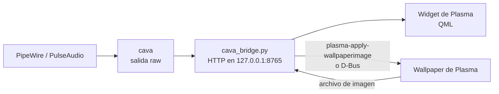

# Cava Viz

[English](README.md) | **Español**

Un widget visualizador de audio para el escritorio de KDE Plasma 6. Dibuja barras finas y reactivas directamente sobre el wallpaper (sin ventana ni fondo) y adapta sus colores al wallpaper actual. También incluye su propia rotación de wallpapers para que los colores siempre coincidan con la imagen en pantalla.


| Panel de configuración | Otro wallpaper |
|---|---|
|  |  |

## Características

**Wave**
- La cantidad de barras se ajusta sola al ancho del widget; solo eliges grosor y hueco en píxeles.
- Tres orientaciones: desde abajo, espejo (con línea de reflejo ajustable) y flotante (centrada).
- Stereo o mono, con distribución de frecuencias normal o invertida.
- Peaks, ocultar en silencio y transiciones suaves de color.
- Glow que pulsa con los graves, con el color de la barra o un color de contraste automático.

**Modos de color**

| Modo | Qué hace |
|---|---|
| Accent + 2do color | Los graves usan el color de acento de Plasma; los agudos, un color vivo tomado del wallpaper |
| Por zona del wallpaper | Cada barra toma el color de la zona del wallpaper donde está. Opción para intercambiar colores entre zonas |
| Contraste | Mismo tono que el fondo detrás del widget, con el brillo invertido |
| Automático (experimental) | Color de la zona, oscurecido o aclarado solo lo necesario para alcanzar un contrast ratio WCAG de 3:1 contra el fondo |

**Wallpaper**
- Rotación desde una carpeta: aleatorio, alfabético o más recientes primero, con intervalo en horas, minutos y segundos.
- "Siguiente wallpaper" desde el menú de clic derecho del widget o con un atajo de teclado.
- Reutiliza la carpeta y las imágenes excluidas de la configuración de presentación de Plasma.

**Consumo de recursos**
- Pausa cava y oculta el widget cuando una ventana lo tapa (configurable: nunca, solo pantalla completa, pantalla completa o maximizada, o cualquier ventana que tape el widget, incluido tiling) o la pantalla está bloqueada.
- Se puede apagar y encender a mano desde el clic derecho o con un atajo (`/toggle`); el estado se conserva tras reiniciar.
- Los cálculos de color se guardan en caché y solo se recalculan cuando cambia el wallpaper, el modo o la posición del widget.

## Requisitos

- KDE Plasma 6 (desarrollado y probado en Kubuntu 26.04 con Plasma 6.6.6, Wayland)
- PipeWire o PulseAudio
- `cava`, `python3-pil` (Pillow) y `curl`. El instalador agrega los que falten con `apt`.
- `plasma-apply-wallpaperimage` y `qdbus6` (incluidos con Plasma)

## Instalación

```bash
git clone https://github.com/kendoulises05-svg/cava-viz.git
cd cava-viz
./install.sh
```

El script instala las dependencias que falten, copia la configuración de cava (nunca sobrescribe una existente), crea e inicia el servicio de usuario `cava-bridge`, e instala o actualiza el widget. Pregunta antes de recargar el escritorio.

Solo la primera vez: clic derecho en el escritorio > **Add Widgets** > **Cava Viz**, y ajusta su tamaño al área que quieras.

Ejecuta `./install.sh` de nuevo después de cada actualización. Para quitar todo:

```bash
./install.sh --uninstall
```

Esto quita el servicio y el widget; tu configuración de cava y tus wallpapers no se tocan.

## Configuración

Clic derecho sobre el widget > **Configure Cava Viz**:

| Página | Opciones |
|---|---|
| Wave | Grosor y hueco, orientación, línea del espejo, canales y distribución de audio, glow, fps, pausar cuando, peaks, ocultar en silencio |
| Color | Modo de color, mezcla del accent, intercambio de colores entre zonas |
| Wallpaper | Activar rotación, carpeta, orden, intervalo, botón de siguiente wallpaper |
| Keyboard Shortcuts | Atajo para "siguiente wallpaper" |

Los modos por zona, contraste y automático necesitan que Cava Viz controle el wallpaper. Si la presentación propia de Plasma está activa, el widget usa el color de acento (ver [Limitaciones conocidas](#limitaciones-conocidas)).

## Cómo funciona



Los widgets de Plasma no pueden leer la salida continua de un proceso, así que un pequeño puente en Python ejecuta cava, guarda el último frame y lo sirve por HTTP, escuchando solo en `127.0.0.1`. El mismo puente rota el wallpaper, lee la imagen con Pillow y calcula los colores de cada modo.

| Archivo | Función |
|---|---|
| `cava_bridge.py` | Puente: proceso de cava, servidor HTTP, rotación de wallpaper, modos de color, pausas |
| `org.kendo.cavaviz/` | El widget de Plasma (QML) y sus páginas de configuración |
| `raw.conf` | Configuración base de cava; el puente solo cambia `bars` y `channels` en una copia temporal |
| `install.sh` | Instalador y desinstalador |

Endpoints del puente, útiles para scripts:

| Endpoint | Función |
|---|---|
| `/` | Último frame de cava (`P` en pausa, `D` apagado a mano) |
| `/next` | Siguiente wallpaper |
| `/disable`, `/enable`, `/toggle` | Apagar, encender o alternar el visualizer (se conserva tras reiniciar) |
| `/state` | `off` si está apagado a mano, `on` si no |
| `/pause`, `/resume` | Pausar o reanudar cava (los usa el widget cuando una ventana lo tapa) |
| `/bars?n=&ch=` | Cantidad de barras y `stereo` / `mono` |
| `/palette`, `/zones`, `/contrast`, `/auto` | Colores del wallpaper (JSON) |
| `/rotation?enabled=&dir=&seconds=&order=` | Configuración de la rotación |

Para asignarlos a atajos de teclado: System Settings > Keyboard > Shortcuts > Add New > Command or Script, con uno de estos comandos:

```bash
curl -s http://127.0.0.1:8765/toggle   # apagar / encender el visualizer
curl -s http://127.0.0.1:8765/next     # siguiente wallpaper
```

## Solución de problemas

| Problema | Revisa |
|---|---|
| El widget no muestra barras | `curl -s http://127.0.0.1:8765/` debe devolver números. Si no: `journalctl --user -u cava-bridge -n 20 --no-pager` |
| El widget muestra un error de QML | `journalctl --user -u plasma-plasmashell -n 30 --no-pager \| grep -iE "cavaviz\|qml"` |
| Todas las barras en 0 | cava escucha la fuente equivocada. Lista las fuentes con `pactl list short sources` y pon la que termina en `.monitor` en `~/.config/cava/raw.conf` (`source = ...`); luego `systemctl --user restart cava-bridge` |
| El wallpaper no cambia | El log del puente muestra el motivo exacto que da Plasma |
| El escritorio no reinicia ("start request repeated too quickly") | `systemctl --user reset-failed plasma-plasmashell` y `systemctl --user start plasma-plasmashell` |

Recarga solo lo que cambió:

| Cambiaste | Comando |
|---|---|
| `cava_bridge.py` o `raw.conf` | `systemctl --user restart cava-bridge` |
| Archivos del widget | `./install.sh` |

## Limitaciones conocidas

- **Presentación de Plasma:** Plasma no expone qué imagen está mostrando su presentación (ni en su archivo de configuración ni por D-Bus), así que los modos de color basados en el wallpaper necesitan la rotación propia de Cava Viz.
- **Wallpapers con mucho detalle:** con muchas zonas pequeñas de color, el modo por zona las promedia y puede elegir colores que no se vean bien.
- **El modo automático** es experimental. En fondos muy detallados puede llevar los colores cerca del negro o el blanco para alcanzar el contraste.
- **Una sola pantalla:** probado solo con un monitor.

## Licencia

GPL-3.0 o posterior. Ver [LICENSE](LICENSE).

## Autor

Kendo ([kendoulises05-svg](https://github.com/kendoulises05-svg))
