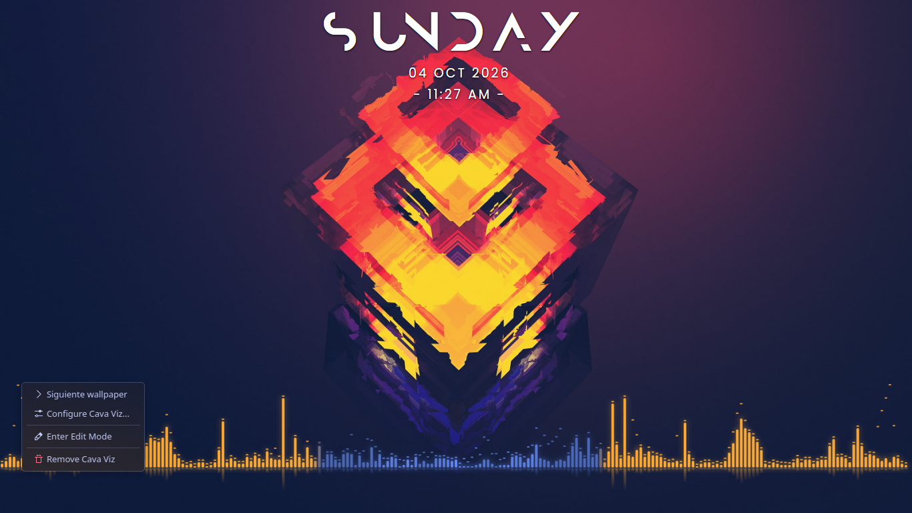
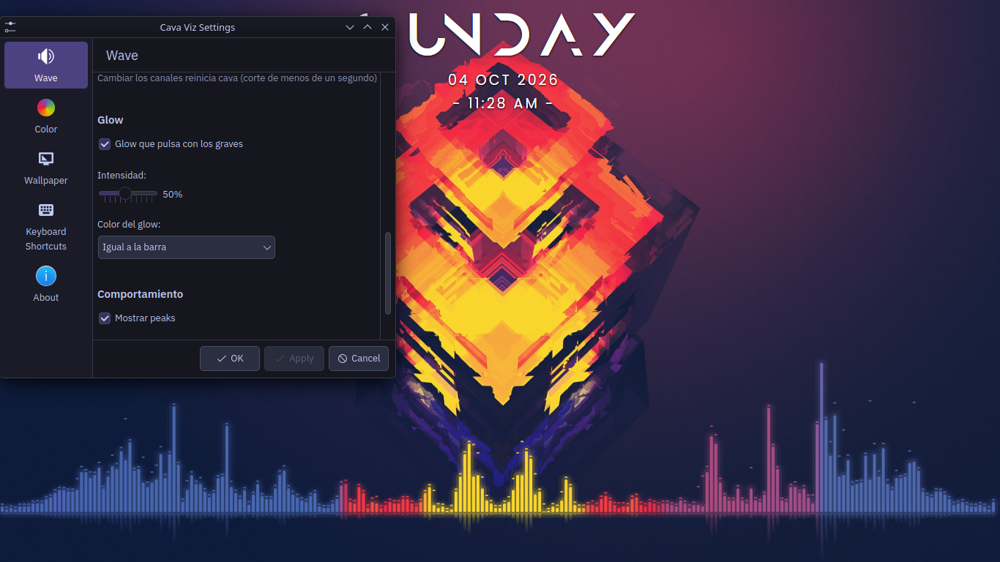
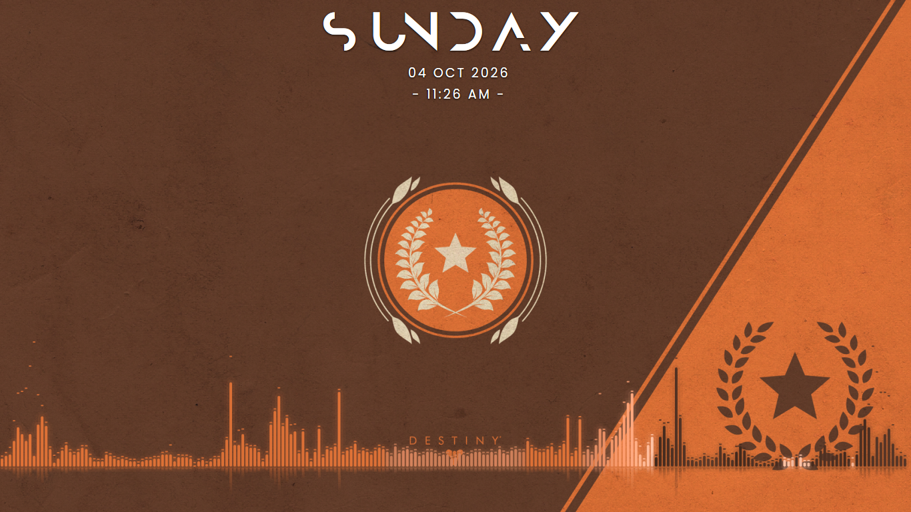
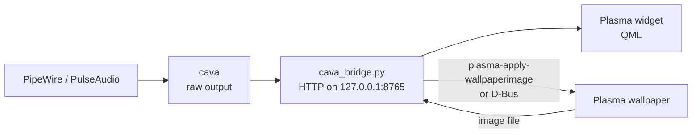

# Cava Viz

**English** | [Español](README.es.md)

An audio visualizer widget for the KDE Plasma 6 desktop. It draws thin, reactive bars directly on the wallpaper (no window, no background) and adapts its colors to the current wallpaper. It also includes its own wallpaper rotation so the colors always match the image on screen.



| Configuration panel | Another wallpaper |
|---|---|
|  |  |

## Features

**Wave**
- Bar count adjusts automatically to the widget width; you only choose bar width and gap in pixels.
- Three orientations: from the bottom, mirror (with an adjustable reflection line) and floating (centered).
- Stereo or mono, with normal or inverted frequency layout.
- Peak caps, hide on silence and smooth color transitions.
- Glow that pulses with the bass, using the bar color or an automatic contrasting color.

**Color modes**

| Mode | What it does |
|---|---|
| Accent + 2nd color | Bass uses the Plasma accent color; treble uses a vivid color taken from the wallpaper |
| By wallpaper zone | Each bar takes the color of the wallpaper area it sits under. Optional color swap between zones |
| Contrast | Same hue as the background behind the widget, with inverted brightness |
| Automatic (experimental) | Zone color, darkened or lightened only as needed to reach a WCAG contrast ratio of 3:1 against the background |

**Wallpaper**
- Rotation from a folder: random, alphabetical or newest first, with an interval in hours, minutes and seconds.
- "Next wallpaper" from the widget right-click menu or a keyboard shortcut.
- Reuses the folder and excluded images from the Plasma slideshow settings.

**Resource usage**
- Pauses cava when a window is fullscreen or the screen is locked.
- Color calculations are cached and only recomputed when the wallpaper, mode or widget position changes.

## Requirements

- KDE Plasma 6 (developed and tested on Kubuntu 26.04 with Plasma 6.6.6, Wayland)
- PipeWire or PulseAudio
- `cava`, `python3-pil` (Pillow) and `curl`. The installer adds the missing ones with `apt`.
- `plasma-apply-wallpaperimage` and `qdbus6` (included with Plasma)

## Installation

```bash
git clone https://github.com/kendoulises05-svg/cava-viz.git
cd cava-viz
./install.sh
```

The script installs missing dependencies, copies the cava config (it never overwrites an existing one), creates and starts the `cava-bridge` user service, and installs or updates the widget. It asks before reloading the desktop.

First time only: right-click the desktop > **Add Widgets** > **Cava Viz**, and resize it to the area you want.

Run `./install.sh` again after any update. To remove everything:

```bash
./install.sh --uninstall
```

This removes the service and the widget; your cava config and wallpapers are not touched.

## Configuration

Right-click the widget > **Configure Cava Viz**:

| Page | Options |
|---|---|
| Wave | Bar width and gap, orientation, mirror line, audio channels and layout, glow, peaks, hide on silence |
| Color | Color mode, accent blend, color swap between zones |
| Wallpaper | Enable rotation, folder, order, interval, next wallpaper button |
| Keyboard Shortcuts | Shortcut for "next wallpaper" |

The zone, contrast and automatic modes need Cava Viz to control the wallpaper. If Plasma's own slideshow is active, the widget falls back to the accent color (see [Known limitations](#known-limitations)).

## How it works



Plasma widgets cannot read a continuous process output, so a small Python bridge runs cava, keeps the latest frame and serves it over HTTP, bound only to `127.0.0.1`. The same bridge rotates the wallpaper, reads the image with Pillow and computes the colors for each mode.

| File | Purpose |
|---|---|
| `cava_bridge.py` | Bridge: cava process, HTTP server, wallpaper rotation, color modes, pause handling |
| `org.kendo.cavaviz/` | The Plasma widget (QML) and its configuration pages |
| `raw.conf` | Base cava config; the bridge only changes `bars` and `channels` in a runtime copy |
| `install.sh` | Installer and uninstaller |

Bridge endpoints, useful for scripting:

| Endpoint | Purpose |
|---|---|
| `/` | Latest cava frame (`P` while paused) |
| `/next` | Next wallpaper |
| `/pause`, `/resume` | Pause or resume cava |
| `/bars?n=&ch=` | Bar count and `stereo` / `mono` |
| `/palette`, `/zones`, `/contrast`, `/auto` | Wallpaper colors (JSON) |
| `/rotation?enabled=&dir=&seconds=&order=` | Rotation settings |

Example, bound to any keyboard shortcut:

```bash
curl -s http://127.0.0.1:8765/next
```

## Troubleshooting

| Problem | Check |
|---|---|
| Widget does not show bars | `curl -s http://127.0.0.1:8765/` should return numbers. If not: `journalctl --user -u cava-bridge -n 20 --no-pager` |
| Widget shows a QML error | `journalctl --user -u plasma-plasmashell -n 30 --no-pager \| grep -iE "cavaviz\|qml"` |
| All bars at 0 | cava is listening to the wrong source. List sources with `pactl list short sources` and set the `.monitor` one in `~/.config/cava/raw.conf` (`source = ...`), then `systemctl --user restart cava-bridge` |
| Wallpaper does not change | The bridge log shows the exact reason from Plasma |
| Desktop fails to restart ("start request repeated too quickly") | `systemctl --user reset-failed plasma-plasmashell` and `systemctl --user start plasma-plasmashell` |

Reload only what changed:

| Changed | Command |
|---|---|
| `cava_bridge.py` or `raw.conf` | `systemctl --user restart cava-bridge` |
| Widget files | `./install.sh` |

## Known limitations

- **Plasma slideshow:** Plasma does not expose which image its slideshow is showing (neither in its config file nor over D-Bus), so the wallpaper-based color modes need Cava Viz's own rotation.
- **Busy wallpapers:** with many small color areas, the zone mode averages them and may pick colors that do not look right.
- **Automatic mode** is experimental. On very detailed backgrounds it may push colors close to black or white to reach the contrast target.
- **Single screen:** tested with one monitor only.

## License

GPL-3.0-or-later. See [LICENSE](LICENSE).

## Author

Kendo ([kendoulises05-svg](https://github.com/kendoulises05-svg))
